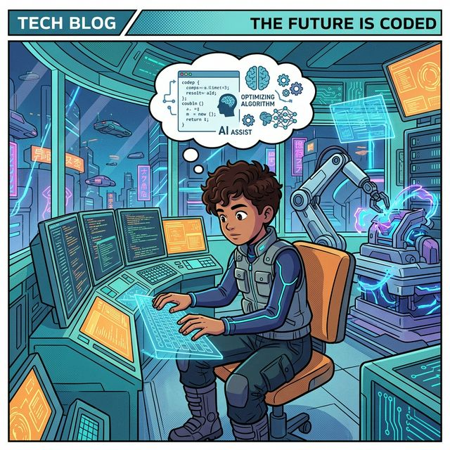
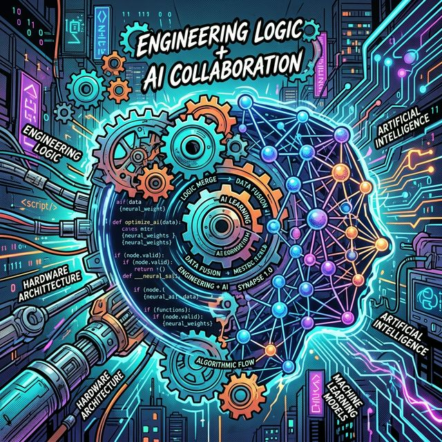

AI 기술 발전 속, 단순히 유행을 쫓는 것은 피상적입니다. 진정한 기술 숙련은 근본 원리 이해와 실질적 문제 해결 능력에 있습니다. 본 분석은 AI 활용의 심층적 접근법과 'AI 증강 코딩'으로의 전환 전략을 제시합니다.

## 목차
* [AI 학습의 본질과 접근 방식](#ai-학습의-본질과-접근-방식)
* [근본 기술 이해의 중요성: 트렌드 추종의 함정](#근본-기술-이해의-중요성-트렌드-추종의-함정)
  * [핵심 기술의 불변성](#핵심-기술의-불변성)
* [AI와의 상호작용: 경험을 통한 감각 형성](#ai와의-상호작용-경험을-통한-감각-형성)
  * [실험적 접근의 중요성](#실험적-접근의-중요성)
  * [AI 능력 범위의 이해](#ai-능력-범위의-이해)
  * [논리적 소통의 필수성](#논리적-소통의-필수성)
* ['바이브 코딩'의 현실과 한계](#바이브-코딩의-현실과-한계)
  * [인간의 역할](#인간의-역할)
  * [바이브 코딩의 문제점](#바이브-코딩의-문제점)
* [효과적인 학습 전략: 필요 중심의 학습](#효과적인-학습-전략-필요-중심의-학습)
  * [필요 중심 학습의 이점](#필요-중심-학습의-이점)
  * [설계 능력의 중요성](#설계-능력의-중요성)
  * [작은 시작과 반복](#작은-시작과-반복)
* [Conclusion: AI 시대의 엔지니어링 접근법](#conclusion-ai-시대의-엔지니어링-접근법)
  * [핵심 요약](#핵심-요약)
  * [결론](#결론)

## AI 학습의 본질과 접근 방식
AI 학습의 정의는 광범위합니다. 단순히 AI 개념을 이해하고 활용처를 파악하는 것에서부터, 특정 AI 서비스 사용법 숙지, 개발자 관점에서 AI 서비스 구축, 나아가 **대규모 언어 모델(LLM)**과 같은 핵심 모델 자체를 연구하는 것까지 포함됩니다. 본 분석에서는 AI를 활용하여 업무 효율성을 증대하고, 특히 **AI 기반 코딩(Vibe Coding)**을 효과적으로 수행하는 방법에 초점을 맞춥니다.

## 근본 기술 이해의 중요성: 트렌드 추종의 함정
최신 AI 기술 동향을 지속적으로 업데이트하는 것은 중요하나, 무분별한 트렌드 추종은 비효율적일 수 있습니다. 기술은 이전 기술을 기반으로 발전하므로, **견고한 근본 기술 지식**을 쌓는 것이 새로운 기술에 대한 적응력을 높이는 핵심입니다.

### 핵심 기술의 불변성
현대 AI 분야에서 논의되는 **MCP(Message Control Program)**의 핵심 통신 방식조차 50년 이상 된 기술에 기반하고 있습니다. 이는 근간이 되는 기술이 쉽게 대체되지 않음을 명확히 보여줍니다. 새로운 AI 기술 역시 기존의 안정적인 인프라와 프로토콜 위에서 구동됩니다.

## AI와의 상호작용: 경험을 통한 감각 형성
AI 활용 능력은 타인의 경험을 듣는 것보다 **직접적인 실행과 자기 주도적 깨달음**을 통해 형성됩니다. 이는 마치 새로운 시스템을 직접 조작하며 특성을 파악하는 엔지니어의 접근 방식과 유사합니다.

### 실험적 접근의 중요성
*   AI 서비스의 **기본 채팅 기능**부터 적극적으로 활용하여 AI의 응답 패턴을 관찰해야 합니다.
*   다양한 질문을 던지며 **AI의 사고방식에 익숙해지는 감각**을 기르는 것이 중요합니다. 이는 낚시에서 최적의 지점을 찾는 과정과 유사하게, AI가 어떤 유형의 입력에 어떻게 반응하는지 파악하는 과정입니다.
*   **AI 작동 원리**에 대한 최소한의 이해는 활용도를 극대화합니다.

### AI 능력 범위의 이해
AI 사용에 미숙한 경우, AI가 수행할 수 없는 작업을 기대하고 요청하는 경향이 있습니다. 예를 들어, 도구 사용 능력이 없는 언어 모델에게 복잡한 연산을 지시하거나, **LLM**이 알지 못하는 정보를 문의하는 경우입니다. 이는 AI의 **능력과 한계에 대한 오해**에서 비롯되므로, 충분한 상호작용을 통해 이러한 오해를 해소해야 합니다.

### 논리적 소통의 필수성
AI와의 효과적인 소통을 위해서는 **의사 코드(Pseudocode)**에 준하는 **논리적이고 명확한 표현**이 필수적입니다. 모호하고 감정적인 언어 대신, 구조화된 논리로 요청을 전달할 때 AI는 훨씬 정확하고 유용한 응답을 생성합니다.

## '바이브 코딩'의 현실과 한계
'바이브 코딩'은 코드의 존재를 망각하고 AI가 모든 것을 처리해 줄 것이라는 기대에 기반한 코딩 방식입니다. 이는 **미래 지향적인 개념**에 가깝지, 현재의 완전한 실현 가능성은 낮습니다.

### 인간의 역할
AI는 코드를 효율적으로 생성할 수 있으나, **코드의 작동 원리 설계 및 AI의 출력 감독**은 여전히 인간의 고유한 역할입니다. 로그인 버튼 구현을 예로 들면, 코드는 AI가 생성해도 로그인 과정의 **동작 원리 설계(Design Specification)**는 인간이 수행해야 합니다.

### 바이브 코딩의 문제점
*   **상황 부적합 코드 생성:** AI가 사용자 상황과 맞지 않는 코드를 생성할 수 있으며, 이에 대한 대처가 어렵습니다.
*   **운영 환경 이해 부족:** AI가 완벽한 코드를 생성하더라도, 해당 코드를 실제 환경(예: **Supabase**, **Google Cloud** 등)에 배포하고 운영하는 방법에 대한 이해가 없으면 무용지물입니다. **개발 과정의 가장 큰 병목 현상**은 코딩 실력보다는 **코드가 실행되는 환경에 대한 이해 부족**에서 발생합니다. 결국 많은 '바이브 코더'들은 개발 학습의 필요성을 인지하게 됩니다.

## 효과적인 학습 전략: 필요 중심의 학습
전통적인 "기초부터 차근차근" 학습 방식은 방대한 개발 분야에서 동기 부여 부족과 끝없는 학습 루프에 빠질 위험이 있습니다. 대신, **상황과 필요가 주도하는 학습**이 더욱 효과적입니다.

### 필요 중심 학습의 이점
*   **동기 부여:** 해결해야 할 문제가 발생할 때, 학습 동기가 자연스럽게 형성됩니다.
*   **문제 해결 능력 강화:** '바이브 코딩'으로 일단 불완전한 코드라도 만들어보고, 여기서 발생하는 문제를 해결하는 과정 자체가 심도 있는 학습으로 이어집니다.
*   **AI 증강 코딩으로의 발전:** 이러한 경험이 축적되면, 단순한 '느낌'에 의존하는 '바이브 코딩'에서 **논리를 기반으로 AI를 활용하는 'AI 증강 코딩'**으로 발전할 수 있습니다.

### 설계 능력의 중요성
코드를 직접 작성하지 못하더라도, 시스템의 **논리적 설계 능력**은 필수적입니다. 인터넷 게시판 예시에서 보듯이, 글 저장 위치, 접근성 등은 전문 지식 없이도 상식적인 사고를 통해 설계할 수 있습니다. 이러한 설계는 AI에게 구체적인 요청을 전달하는 기반이 됩니다.

### 작은 시작과 반복
항상 **작게 시작하여 완전한 사이클을 경험**하고, 성공적인 결과물을 먼저 도출하는 것이 중요합니다. 이후 점진적으로 확장해 나가는 방식은 AI 시대에도 여전히 유효한 전략입니다. 문제 발생은 학습과 개선의 기회로 삼아야 합니다.

## Conclusion: AI 시대의 엔지니어링 접근법
AI는 무제한의 정보를 제공하는 강력한 도구이자 **지식 선생님**입니다. 그러나 이 도구의 잠재력을 최대한 활용하기 위해서는 **수동적인 정보 수용자**가 아닌 **능동적인 문제 해결자**로서의 자세가 요구됩니다.

### 핵심 요약
*   **근본 기술 이해:** 새로운 트렌드보다 핵심 원리에 대한 깊이 있는 이해가 선행되어야 합니다.
*   **경험 기반 학습:** AI와의 직접적인 상호작용을 통해 '감각'을 기르고, AI의 능력과 한계를 명확히 인지해야 합니다.
*   **논리적 설계 능력:** 코드를 직접 작성하는 것을 넘어, 시스템의 논리적 구조와 작동 원리를 설계하는 능력이 필수적입니다.
*   **필요 중심 학습:** 실제 문제 해결을 통해 지식을 습득하고, '바이브 코딩'을 'AI 증강 코딩'으로 발전시키는 계기로 삼아야 합니다.

### 결론
AI 시대의 엔지니어는 단순히 AI를 사용하는 것을 넘어, **AI를 활용하여 문제를 정의하고, 해결책을 설계하며, 시스템을 통합하는 역량**을 갖추어야 합니다. 이는 지속적인 실험, 논리적 사고, 그리고 근본 원리에 대한 이해를 통해 달성될 수 있습니다. AI는 강력한 조력자이지만, 최종적인 책임과 방향 설정은 항상 인간 엔지니어의 몫입니다.