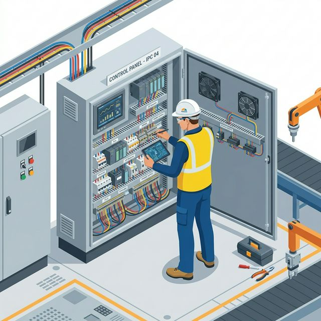
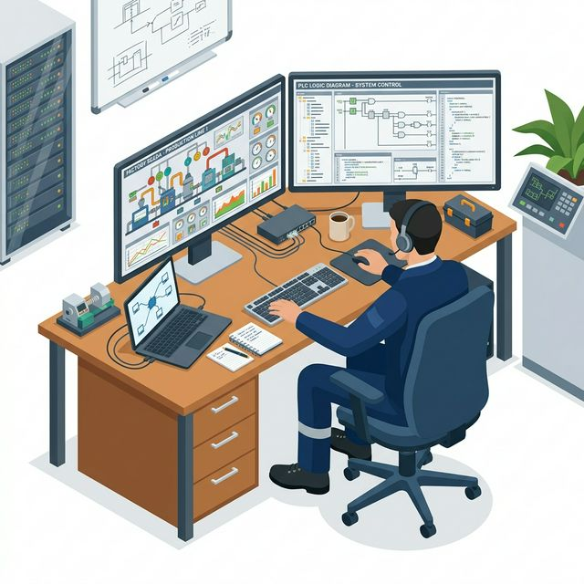

산업 현장에서 PLC는 여전히 견고한 제어기로서 기능하지만, PC 기반 제어는 더 높은 컴퓨팅 파워와 유연성으로 자동화의 새로운 지평을 열고 있습니다. 이 분석은 그 핵심을 파고듭니다.

## 목차
- [PC 기반 제어의 부상: 산업 자동화의 새로운 지평](#pc-기반-제어의-부상-산업-자동화의-새로운-지평)
  - [PLC를 넘어서는 PC의 역할](#plc를-넘어서는-pc의-역할)
- [PC 기반 제어 시스템의 핵심 구성 요소](#pc-기반-제어-시스템의-핵심-구성-요소)
  - [하드웨어 플랫폼: 산업용 PC (IPC)](#하드웨어-플랫폼-산업용-pc-ipc)
  - [운영 체제 (OS) 및 실시간 OS (RTOS)](#운영-체제-os-및-실시간-os-rtos)
  - [제어 소프트웨어: Soft PLC의 등장](#제어-소프트웨어-soft-plc의-등장)
- [산업용 I/O 인터페이스의 진화](#산업용-io-인터페이스의-진화)
  - [전통적인 직접 I/O 카드 방식](#전통적인-직접-io-카드-방식)
  - [필드버스 및 산업용 이더넷 기반의 분산 I/O](#필드버스-및-산업용-이더넷-기반의-분산-io)
- [다양한 산업용 PC (IPC) 유형](#다양한-산업용-pc-ipc-유형)
- [PC 기반 제어 소프트웨어 심층 분석](#pc-기반-제어-소프트웨어-심층-분석)
  - [IT 기반 개발 환경: Visual Studio](#it-기반-개발-환경-visual-studio)
  - [그래픽 기반 개발 환경: LabVIEW 및 MATLAB](#그래픽-기반-개발-환경-labview-및-matlab)
  - [통합 자동화 플랫폼: Beckhoff TwinCAT](#통합-자동화-플랫폼-beckhoff-twincat)
- [분산 제어 시스템 (DCS) 및 SCADA와의 관계](#분산-제어-시스템-dcs-및-scada와의-관계)
- [결론: PLC와 PC, 공존과 융합의 미래](#결론-plc와-pc-공존과-융합의-미래)
  - [기술적 요약](#기술적-요약)
  - [최종 결론](#최종-결론)
- [다음 리포트 예고](#다음-리포트-예고)

---

## PC 기반 제어의 부상: 산업 자동화의 새로운 지평

퍼스널 컴퓨터(PC)는 1970년대에 등장하여 1990년대 32비트 IBM PC와 Windows 95의 보급과 함께 대중화되었습니다. 2010년대 이후 모바일 및 클라우드 컴퓨팅 환경의 확산으로 PC는 우리 일상에 필수적인 요소로 자리 잡았습니다. 이러한 PC의 발전은 단순한 개인 및 사무용 활용을 넘어, 산업 현장에서 기계 제어의 핵심 동력으로 부상하게 됩니다.

### PLC를 넘어서는 PC의 역할

기존 산업 제어 분야에서는 **PLC(Programmable Logic Controller)**가 범용적인 제어기로서 광범위하게 사용되어 왔습니다. 그러나 1990년대부터 PLC를 대체할 수 있는 PC 기반 제어기의 적용 가능성에 대한 연구와 타당성 검토가 본격화되었습니다. 현재 PC는 산업 현장에서 없어서는 안 될 중요한 요소로 자리매김하고 있으며, 특히 반도체 산업과 같은 고정밀 제어 분야에서 활용도가 높습니다.

PC 기반 제어는 PLC 대비 **우수한 CPU, 넉넉한 메모리 용량** 등 강력한 컴퓨팅 파워를 기반으로 다음과 같은 이점을 제공합니다.

*   **고속 제어 및 고정밀 제어:** PLC로는 구현하기 어려운 복잡하고 정교한 제어에 강점을 가집니다.
*   **IT 분야와의 융합:** 스마트 팩토리 구현에 필수적인 요소로, 데이터 처리 및 상위 시스템 연동에 용이합니다.

## PC 기반 제어 시스템의 핵심 구성 요소

PC 기반 제어는 일반적인 PC와 유사한 하드웨어 및 소프트웨어 구조를 가지지만, 산업 제어에 특화된 요소들이 추가됩니다. 여기서 말하는 PC 기반 제어는 PLC를 대체하여 기계를 제어하는 목적에 한정됩니다.

### 하드웨어 플랫폼: 산업용 PC (IPC)

산업 현장에서는 일반 PC가 아닌 **산업용 PC(Industrial PC, IPC)**를 주로 사용합니다. IPC는 혹독한 환경에서도 안정적으로 작동하도록 설계되며, 제어에 필요한 입출력(I/O) 인터페이스를 확장할 수 있는 슬롯을 제공합니다.

### 운영 체제 (OS) 및 실시간 OS (RTOS)

*   **일반 운영 체제 (OS):** 가장 널리 사용되는 OS는 **Windows**로, PC 시장의 90% 이상을 차지합니다. 또한, **Linux**와 같은 OS도 산업용 제어기나 특수 목적으로 사용됩니다.
*   **실시간 운영 체제 (RTOS):** 일반적인 Windows OS는 **하드 리얼타임(Hard Real-time)** 기능을 구현하지 못합니다. 하드 리얼타임이란 정해진 시간 안에 입출력 명령을 정확히 수행하는 것을 의미하며, 산업 제어에서는 필수적인 요소입니다. 따라서 PC 기반 제어에서는 Windows OS와 별개로 **VxWorks, INtime, RTX**와 같은 **RTOS**를 별도로 설치하여 실시간 제어를 담당하게 합니다.

### 제어 소프트웨어: Soft PLC의 등장

제어를 위한 소프트웨어는 크게 **개발 환경**과 **실행 환경**으로 구분됩니다. 개발 환경은 프로그래밍 및 코딩을 수행하는 공간이며, 실행 환경은 RTOS 기반의 런타임 엔진에서 실제 태스크를 수행합니다. 이러한 PC 기반 제어 시스템은 마치 PLC처럼 사용된다고 하여 **Soft PLC**라고도 불립니다.

## 산업용 I/O 인터페이스의 진화

PC가 실제 기계를 제어하기 위해서는 외부 장치와 통신할 수 있는 입출력 인터페이스가 필수적입니다. 일반 PC는 산업용 I/O 신호(예: DC 24V, 0-10V, 4-20mA)를 처리할 수 있는 포트나 단자가 없으므로, 별도의 인터페이스 구성이 필요합니다.

### 전통적인 직접 I/O 카드 방식

초기 PC 기반 제어 시스템에서는 IPC 내부에 **디지털 입출력 카드, 아날로그 입출력 카드, 모션 제어 카드**와 같은 I/O 카드를 직접 장착했습니다. 이 카드들은 외부 단자대와 케이블로 연결되어 솔레노이드, 릴레이, 스위치, 센서 등을 제어했습니다.

*   **장점:** 직접 연결로 인한 빠른 응답 속도.
*   **단점:**
    *   제한된 I/O 카드 슬롯 수.
    *   PC와 외부 장치 간의 거리 제약 (일반적으로 10~15m 이내).
    *   I/O 수가 많아질수록 복잡해지는 케이블링.

### 필드버스 및 산업용 이더넷 기반의 분산 I/O

이러한 전통적인 방식의 단점을 개선하기 위해 **필드버스(Fieldbus)** 통신 방식이 도입되었습니다. PC에는 특수한 통신 카드를 장착하고, 장비가 설치된 위치에 **리모트 I/O 모듈**을 배치하여 통신 케이블로 연결하는 방식입니다.

*   **필드버스:** Modbus, DeviceNet, Profibus, CC-Link 등이 대표적이며, 과거에는 고가의 통신 카드가 필요했습니다.
*   **산업용 이더넷:** 최근에는 EtherCAT, Modbus TCP와 같은 **산업용 이더넷** 방식이 널리 사용됩니다.
*   **장점:**
    *   리모트 I/O 모듈의 유연한 배치.
    *   다양한 네트워크 토폴로지 지원.
    *   장거리 통신 가능.
    *   복잡한 케이블링 감소.

## 다양한 산업용 PC (IPC) 유형

산업 현장의 다양한 요구사항을 충족하기 위해 여러 형태의 IPC가 개발되었습니다.

*   **19인치 랙 타입 산업용 PC:** 일반적인 데스크톱 PC보다 확장 슬롯이 많아 I/O 카드 장착에 유리하며, 랙에 설치하여 사용합니다.
*   **패널 PC:** 모니터, 키보드, 마우스 기능이 통합된 터치패널 형태의 PC입니다. 공간 효율성이 뛰어나지만, 랙 타입에 비해 확장성은 다소 떨어집니다.
*   **컴팩트 PC:** 컨트롤 캐비닛 내부에 설치하기 적합하도록 소형으로 설계된 PC입니다.
*   **팬리스 (Fanless) 타입 PC:** CPU 및 시스템 냉각 팬이 없는 구조로, 팬 고장으로 인한 시스템 다운을 방지하고 먼지가 많은 산업 환경에 적합합니다.
*   **임베디드 PC (EPC):** 모니터 포트, LAN, USB 포트 등 PC 기능을 갖추고 Windows Embedded Compact 또는 IoT와 같은 경량 OS가 설치되며, I/O 모듈이 통합되어 PLC와 유사한 형태로 사용됩니다.

## PC 기반 제어 소프트웨어 심층 분석

PC 기반 제어 소프트웨어는 다양한 목적과 용도로 개발되고 있으며, 개발 방식에 따라 크게 IT 기반과 자동화 기반으로 나눌 수 있습니다.

### IT 기반 개발 환경: Visual Studio

마이크로소프트의 **Visual Studio**는 C, C++, C#과 같은 프로그래밍 언어를 사용하여 Windows 애플리케이션을 개발하는 데 가장 널리 사용되는 통합 개발 환경(IDE)입니다.

*   **특징:**
    *   다양한 언어 지원.
    *   유연한 사용자 인터페이스(UI) 개발 가능.
*   **요구 사항:**
    *   해당 프로그래밍 언어에 대한 높은 숙련도.
    *   I/O 보드 및 전자회로 인터페이스에 대한 이해.
    *   개발에 상당한 시간과 노력이 소요됩니다.

### 그래픽 기반 개발 환경: LabVIEW 및 MATLAB

IT 기반 언어의 복잡성을 해결하고 개발 편의성을 높이기 위해 개발된 소프트웨어들입니다.

*   **NI LabVIEW (National Instruments):**
    *   **그래픽 언어(G 언어)**를 기반으로 아이콘과 와이어를 사용하여 직관적으로 프로그램을 개발합니다.
    *   주로 **테스트 및 측정(Test & Measurement)** 분야, 즉 시험 장비의 성능 평가, 내구성 검사, 기능 검사 등에 활용됩니다.
*   **MathWorks MATLAB/Simulink:**
    *   주로 공학 분야에서 제어 시스템 설계, 분석, 시뮬레이션 용도로 사용됩니다.
    *   특정 애드온이나 툴박스를 통해 제어에도 활용될 수 있지만, 본연의 강점은 분석 및 시뮬레이션입니다.

### 통합 자동화 플랫폼: Beckhoff TwinCAT

독일 Beckhoff사의 **TwinCAT**은 Soft PLC 개념에 가장 근접한 소프트웨어로 평가됩니다. 1980년대 PC 기반 NC 시스템 적용을 시작으로 발전해 왔습니다.

*   **TwinCAT 3 (2010년 출시):** Microsoft Visual Studio에 통합되어, C, C++, C#과 같은 IT 언어와 PLC 언어(IEC 61131-3)를 **하나의 환경에서 동시에 사용**할 수 있는 강력한 이점을 제공합니다.
*   **Beckhoff와 EtherCAT:** Beckhoff는 2003년 **EtherCAT**이라는 산업용 이더넷 통신 방식을 개발한 회사이기도 합니다. EtherCAT은 현재 산업 현장에서 가장 범용적으로 사용되는 네트워크 방식 중 하나로, TwinCAT과 EtherCAT은 Beckhoff의 통합 시스템 솔루션을 구성합니다.
*   **IT-OT 융합:** TwinCAT은 IT 분야 엔지니어와 자동화 분야 엔지니어 모두에게 익숙한 환경을 제공하여, 장비 제어 및 공정 제어를 용이하게 하고, 동시에 데이터 관리 및 상위 시스템 연동을 하나의 플랫폼에서 처리할 수 있도록 합니다. 이는 스마트 팩토리 구현의 핵심적인 부분입니다.

## 분산 제어 시스템 (DCS) 및 SCADA와의 관계

PC 기반 제어를 논할 때 **DCS(Distributed Control System)** 및 **SCADA(Supervisory Control and Data Acquisition)** 시스템도 함께 언급됩니다. 이 시스템들은 모두 PC를 기반으로 하지만, 역할과 중점 분야에서 차이가 있습니다.

*   **DCS:**
    *   **공정 제어(Process Control)** 분야(수처리, 제철, 석유화학, 발전 등)에서 주로 사용됩니다.
    *   여러 개의 PLC와 같은 제어기들이 분산되어 있고, 이들을 하나의 PC 기반 시스템으로 통합하여 제어하는 방식입니다.
    *   제어 로직, 레시피 등이 PC를 통해 명령됩니다.
*   **SCADA:**
    *   산업 현장의 설비 현황을 종합적으로 **모니터링하고 제어**하는 시스템입니다.
    *   HMI(Human Machine Interface) 기능에 가깝고, 일반적으로 I/O를 직접 제어하기보다는 PLC에 명령을 전달하여 제어를 수행합니다.
*   **PC 기반 제어와의 관계:** DCS와 SCADA는 PC를 활용한다는 점에서 PC 기반 제어와 공통점을 가지지만, Soft PLC와 같은 직접적인 장비 제어 기능보다는 상위 수준의 제어, 모니터링, 데이터 취득 및 관리에 중점을 둡니다. 하지만 TwinCAT과 같은 소프트웨어는 직접적인 장비 제어와 모니터링을 동시에 수행하며 이러한 영역을 포괄합니다.

## 결론: PLC와 PC, 공존과 융합의 미래

초창기 PC 기반 제어의 등장과 함께 PLC가 PC로 완전히 대체될 것이라는 전망이 있었습니다. 그러나 현 시점에서 이러한 극단적인 예측은 현실화되지 않고 있으며, 오히려 **PLC와 PC의 기능이 상호 보완적으로 융합**하는 방향으로 발전하고 있습니다.

### 기술적 요약

*   **PC의 강점:** 고성능 CPU, 대용량 메모리를 기반으로 고속/고정밀 제어, IT 시스템과의 통합에 유리합니다. RTOS를 통해 실시간성을 확보합니다.
*   **PLC의 강점:** 견고한 하드웨어, 안정적인 실시간 제어, 산업 환경에 최적화된 설계.
*   **융합의 방향:**
    *   **PLC 제조사:** Siemens, Rockwell Automation, Mitsubishi, Omron 등 주요 PLC 제조사들은 PLC에 PC의 기능을 통합하여 업그레이드하고 있습니다.
    *   **PC 기반 소프트웨어 개발사:** SCADA, DCS 등 PC 기반 솔루션 개발사들도 PLC의 제어 기능을 자사 시스템에 추가하고 있습니다.
*   **새로운 흐름:** 라즈베리 파이와 같은 **싱글 보드 컴퓨터(SBC)**도 저렴한 비용과 개방성을 바탕으로 산업용 IoT 기기로서 현장에 적용되는 시도가 증가하고 있습니다. 통신 속도의 향상과 산업 프로토콜의 표준화 및 개방화는 이러한 융합과 새로운 시도를 가속화하고 있습니다.

### 최종 결론

PLC와 PC는 서로의 강점을 흡수하며 발전하고 있으며, 미래의 산업 자동화는 이 두 기술의 **공존과 융합**을 통해 더욱 지능적이고 유연한 시스템을 구축해 나갈 것입니다. 특정 기술이 다른 기술을 완전히 대체하기보다는, 각자의 역할과 장점을 극대화하며 시너지를 창출하는 방향으로 나아갈 것으로 판단됩니다.

---

## 다음 리포트 예고

다음 리포트에서는 산업용 이더넷의 핵심 기술인 EtherCAT에 대해 심층적으로 분석하고, 실제 현장에서 EtherCAT을 효과적으로 구축하고 활용하는 실무 팁을 다룰 예정입니다.

오늘의 분석이 현장 업무에 도움이 되길 바랍니다. Mr.FIX였습니다.