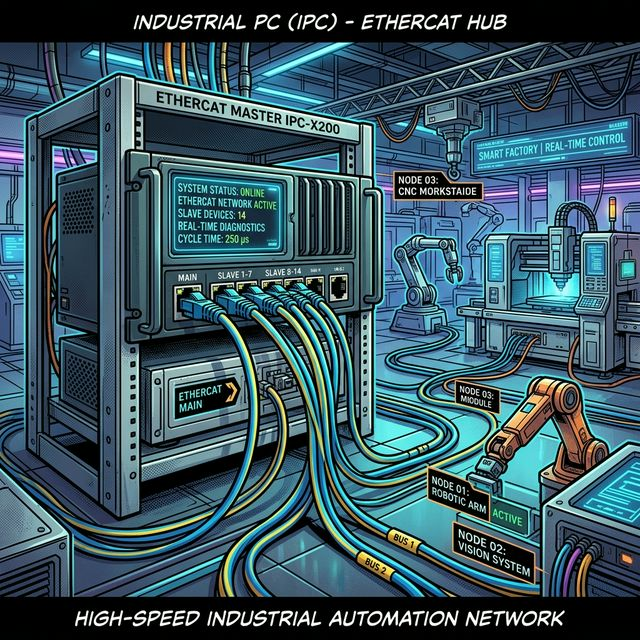
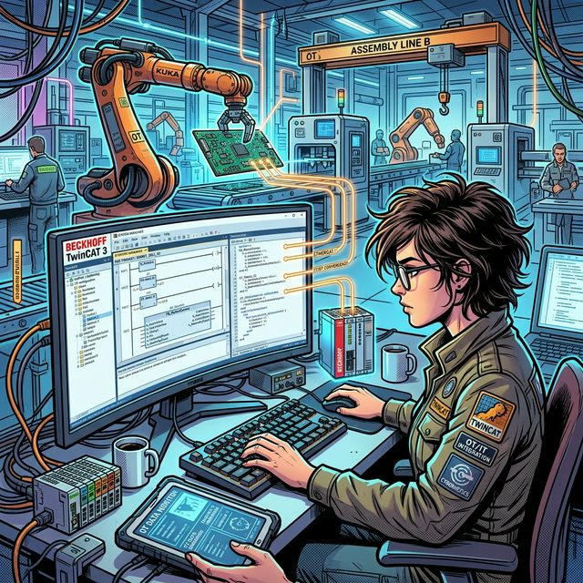

산업 자동화 분야에서 PC 기반 제어 시스템은 그 역할과 중요성이 점차 증대되고 있습니다. 본 분석 리포트에서는 9년 차 베테랑 PLC 제어 및 전기 설계 엔지니어의 관점에서, PC 기반 제어의 역사적 배경부터 핵심 구성 요소, 주요 소프트웨어 동향, 그리고 기존 PLC 시스템과의 관계 및 미래 전망까지 심층적으로 탐구하고자 합니다. 특히, 고속·고정밀 제어 및 스마트 팩토리 구현에 있어 PC 기반 제어가 제공하는 독보적인 가치에 주목합니다.

## 목차

*   [PC 기반 제어의 태동과 산업 현장으로의 확장](#pc-기반-제어의-태동과-산업-현장으로의-확장)
*   [PC 기반 제어 시스템의 핵심 구성 요소](#pc-기반-제어-시스템의-핵심-구성-요소)
*   [주요 PC 기반 제어 소프트웨어 분석](#주요-pc-기반-제어-소프트웨어-분석)
*   [분산 제어 시스템(DCS) 및 SCADA 시스템과의 관계](#분산-제어-시스템dcs-및-scada-시스템과의-관계)
*   [PLC와 PC 기반 제어: 경쟁에서 융합으로](#plc와-pc-기반-제어-경쟁에서-융합으로)
*   [결론 (Conclusion)](#결론-conclusion)
*   [다음 리포트 예고](#다음-리포트-예고)

## PC 기반 제어의 태동과 산업 현장으로의 확장개인용 컴퓨터(PC)는 1970년대 등장하여 1980년대 16비트, 1990년대 32비트 IBM PC 및 Windows 95의 보급을 통해 일상생활에 깊숙이 자리 잡았습니다. 2000년대에는 64비트 시스템이 대중화되었으며, 2010년대 이후에는 모바일 및 클라우드 컴퓨팅 환경으로 발전하였습니다.

이러한 PC의 발전은 단순히 개인 및 사무용 영역에 머무르지 않고, 산업 현장의 기계 제어 분야로 확장되었습니다. 기존 산업 제어의 범용적인 제어기로서 PLC(Programmable Logic Controller)가 GM(General Motors)의 적용 사례를 시작으로 1990년대부터 본격적으로 산업 현장에 도입된 바 있습니다. PC 기반 제어는 이러한 PLC의 역할을 대체하거나 보완하며, 특히 **PLC가 수행하기 어려운 고속 제어 및 고정밀 제어 분야**에서 그 강점을 발휘하고 있습니다. 이는 PC가 PLC보다 우수한 CPU 성능과 대용량 메모리를 기반으로 하는 **강력한 컴퓨팅 파워**를 제공하기 때문입니다.

최근에는 IT 분야와의 융합을 통한 **스마트 팩토리 구현**에 있어 PC 기반 제어가 핵심적인 요소로 부상하고 있습니다. 반도체 산업 현장과 같이 고도의 정밀 제어가 요구되는 환경에서는 PC를 활용한 제어 방식이 보편화되고 있습니다.

## PC 기반 제어 시스템의 핵심 구성 요소PC 기반 제어는 일반적인 산업용 기계 제어, 즉 PLC를 대체하는 목적으로 한정하여 정의됩니다. 이러한 PC 기반 제어 시스템의 주요 구성 요소는 다

음과 같습니다.#

## 하드웨어 플랫폼일반적인 PC 하드웨어 플랫폼을 기반으로 합니다. 이는 고성능 프로세서와 대용량 메모리를 포함하며, 산업 환경에 적합하도록 내구성 및 신뢰성이 강화된 형태로 제공됩니다.#

## 운영체제 (OS)PC 기반 제어에는 크게 두 가지 유형의 운영체제가 사용됩니다.
*   **일반 운영체제**: Microsoft Windows가 PC 시장의 90% 이상을 차지하며 가장 널리 사용됩니다. 그러나 Windows는 **하드 리얼타임(Hard Real-Time, HRT) 기능**을 기본적으로 제공하지 않습니다. HRT는 정해진 시간 내에 정확한 입력/출력 명령을 수행해야 하는 산업 제어의 필수 요소입니다. 따라서 일반적인 윈도우 OS는 산업용 제어에 직접 적용하기 어렵습니다.
*   **실시간 운영체제 (RTOS)**: Windows OS와 별개로 VxWorks, INtime, RTX와 같은 RTOS가 별도로 설치되어 실제 제어 태스크를 관장합니다. RTOS는 정주기성 및 정확한 시간 제어를 구현하여, 산업용 제어기의 요구사항을 충족시킵니다.
*   **기타 운영체제**: 리눅스와 같은 OS도 라즈베리파이와 같은 소형 컴퓨터나 특정 산업용 제어기에서 사용되기도 합니다.#

## 제어 소프트웨어 (Control Software)다

양한 회사에서 특정 목적을 위해 개발된 제어 소프트웨어가 사용됩니다. 이 소프트웨어는 **개발 환경(프로그래밍/코딩)**과 **실행 환경(RTOS 기반 런타임 엔진)**으로 구분됩니다. PC 기반 제어 소프트웨어는 종종 **소프트 PLC(Soft PLC)**라고도 불립니다.#

## 입출력 (I/O) 인터페이스일반 PC는 산업용 DC 24V 디지털 신호나 0~10V / 4~20mA 아날로그 신호와 같은 외부 입출력을 직접 처리할 수 없습니다. 따라서 별도의 I/O 인터페이스가 필요합니다.
*   **I/O 카드**: 산업용 PC(IPC)에 디지털 입출력 카드, 아날로그 입출력 카드, 모션 제어 카드 등을 장착하여 외부 센서, 액추에이터 등과 연결합니다. 전통적인 방식은 이 카드를 통해 외부 단자대로 직접 배선하는 방식이었으나, 이는 I/O 수량 증가 시 복잡한 케이블링과 거리 제약(10~15m 이내)이라는 단점을 가집니다.
*   **필드버스 및 산업용 이더넷**: 이러한 단점을 극복하기 위해 통신 기술이 도입되었습니다. PC에 통신 카드를 장착하고, 장비 설치 위치에 **리모트 I/O 모듈**을 배치하여 통신 케이블로 연결합니다. 과거에는 Modbus, DeviceNet, Profibus, CC-Link와 같은 필드버스 방식이 사용되었으나, 현재는 EtherCAT, Modbus TCP와 같은 **산업용 이더넷 방식**이 보편화되었습니다. 산업용 이더넷은 원격 I/O 배치 유연성, 다

양한 토폴로지 지원, 거리 제약 완화 등 상당한 이점을 제공합니다.

## 산업용 PC (IPC)의 다

양한 형태산업 현장에서 사용되는 PC는 일반 PC와는 다

른 특성과 형태를 가집니다. 주요 산업용 PC(IPC)의 종류는 다

음과 같습니다.#

## 19인치 랙 타입 산업용 PC가장 흔하게 볼 수 있는 형태로, 일반 데스크톱 PC보다 큰 본체 케이스를 가지며, PCI 또는 PCIe 확장 슬롯이 충분히 제공되어 다

양한 I/O 카드 및 통신 카드를 장착할 수 있도록 설계되었습니다.#

## 패널 PC모니터와 PC 본체가 일체형으로 통합된 형태로, 터치 패널이 적용되는 경우가 많습니다. 랙 타입 IPC에 비해 확장성은 다

소 떨어지지만, 컴팩트한 설치가 가능하여 공간 제약이 있는 산업 현장에 적합합니다.#

## 컴팩트 PC제어 캐비닛 내부에 설치하기에 적합하도록 매우 작은 크기로 설계된 PC입니다.#

## 팬리스 (Fanless) PCCPU 및 시스템 냉각을 위한 팬이 없는 구조의 PC입니다. 팬 고장으로 인한 PC 다

운 문제를 해결하고, 분진이 많은 산업 환경에서의 신뢰성을 높이기 위해 개발되었습니다.#

## 임베디드 PC (EPC)I/O 모듈이 PC 본체와 통합된 형태로, 외형적으로는 PLC와 유사하게 보입니다. Windows Embedded Compact (구 Windows CE) 또는 IoT와 같은 경량화된 OS가 설치되어 특정 기능에 최적화된 제어를 수행합니다.

## 주요 PC 기반 제어 소프트웨어 분석PC 기반 제어 소프트웨어는 다

양한 언어와 환경을 제공하며, 각기 다

른 목적과 용도에 따라 활용됩니다.#

## Microsoft Visual Studio (C, C++, C#)IT 개발자에게 가장 익숙한 개발 환경으로, C, C++, C# 등의 프로그래밍 언어를 사용하여 윈도우 애플리케이션 및 제어 프로그램을 개발합니다. 이 방식은 **언어 학습에 상당한 시간이 소요**되며, 외부 하드웨어(I/O 보드 등)를 제어하기 위해서는 **전자회로 및 인터페이스 보드에 대한 지식**이 필수적으로 요구됩니다.#

## National Instruments LabVIEW그래픽 기반 프로그래밍 언어(G 언어)를 사용하여 아이콘과 와이어 연결 방식으로 프로그램을 개발합니다. 직관적인 개발이 가능하여 **개발 시간 단축**에 강점을 가집니다. 주로 **테스트 및 측정(Test & Measurement)** 분야, 즉 제품의 성능 평가, 내구성/기능 검사 등의 시험 장비 구축에 널리 활용됩니다.#

## MathWorks MATLAB / Simulink주로 공학 분야에서 제어 시스템의 **설계, 분석, 시뮬레이션** 용도로 사용됩니다. 애드온 또는 툴박스를 통해 제어에도 활용될 수 있지만, 핵심적인 용도는 분석 및 시뮬레이션에 있습니다.#

## Beckhoff TwinCATBeckhoff(독일)에서 개발한 TwinCAT은 **소프트 PLC 개념에 가장 근접한 소프트웨어**입니다. 1980년대 NC 시스템에 PC를 적용하는 것에서 시작하여 발전하였으며, 2010년 TwinCAT 3 버전부터는 Microsoft Visual Studio에 통합되어 제공됩니다. 이는 **C, C++, C#과 같은 IT 언어와 IEC 61131-3 표준 PLC 언어를 단일 환경에서 함께 사용**할 수 있는 큰 장점을 제공합니다.

Beckhoff는 또한 **EtherCAT**이라는 산업용 이더넷을 개발한 회사로 잘 알려져 있습니다. EtherCAT은 2003년에 개발되어 현재 산업 현장에서 가장 범용적으로 사용되는 산업용 네트워크 방식 중 하나입니다.

TwinCAT의 Visual Studio 통합은 IT 분야 엔지니어와 자동화 분야 엔지니어 간의 **기술적 장벽을 허무는 중요한 의미**를 가집니다. 과거에는 PLC와 PC가 별개로 존재하여 데이터 통신을 통해 정보를 주고받아야 했지만, 통합된 플랫폼 내에서 PC가 로직 제어를 직접 수행하고, 데이터 표시, 저장, 관리까지 동시에 처리할 수 있게 되었습니다. 이는 생산 데이터 관리와 로직 제어를 하나의 시스템에서 구현함으로써 **스마트 팩토리의 핵심 인프라**를 제공합니다.

## 분산 제어 시스템(DCS) 및 SCADA 시스템과의 관계PC 기반 제어를 논할 때 DCS(Distributed Control System)와 SCADA(Supervisory Control And Data Acquisition) 시스템이 자주 언급됩니다.#

## DCS (Distributed Control System)분산 제어 시스템은 수처리, 제철, 석유화학, 발전과 같은 **공정 제어(Process Control)** 분야에서 주로 사용됩니다. 여러 개의 분산된 제어기(PLC와 유사)들이 하나의 PC 기반 시스템으로 통합되어 전체 공정을 제어하는 형태입니다.#

## SCADA (Supervisory Control And Data Acquisition)스카다 시스템은 산업 현장의 설비 현황을 중앙 모니터링 룸에서 **종합적으로 감시(Supervisory Control)하고 데이터를 취득(Data Acquisition)**하는 데 중점을 둡니다. 이는 HMI(Human Machine Interface)의 기능에 가깝다

고 볼 수 있으며, 일반적으로 I/O를 직접 제어하기보다

는 PLC에 명령을 전달하여 제어를 수행하게 합니다.

DCS와 SCADA는 모두 PC를 기반으로 하지만, **주된 역할에 약간의 차이**가 있습니다. DCS는 제어 로직과 레시피 관리 등 직접적인 제어 기능이 강조되며, PC 기반 제어와 중복되는 영역이 많습니다. 반면 SCADA는 데이터 취득, 디스플레이 및 상위 시스템과의 연동에 더 집중하는 경향이 있습니다. PC 기반 제어(예: TwinCAT)는 직접적인 장비 제어와 모니터링을 동시에 수행하며 하드 리얼타임을 구현하는 반면, SCADA는 주로 데이터 취득 및 표시 용도로 사용되어 직접적인 하드 리얼타임 제어는 수행하지 않는다

는 점에서 차이가 있습니다.

## PLC와 PC 기반 제어: 경쟁에서 융합으로초창기에는 PC 기반 제어가 PLC를 완전히 대체할 것이라는 전망도 있었습니다. 그러나 현재의 기술 흐름은 단순한 대체가 아닌 **상호 보완적 융합**의 방향으로 전개되고 있습니다.

주요 PLC 제조사(Siemens, Rockwell Automation, Mitsubishi, Omron 등)들은 PC가 가진 다

양한 기능을 수용할 수 있도록 PLC를 지속적으로 발전시키고 있습니다. 마찬가지로 SCADA, DCS, Soft PLC 등 PC 기반 소프트웨어 개발사들 역시 PLC의 영역이었던 제어 기능들을 추가적으로 구현하고 있습니다.

이는 PLC와 PC 기반 제어의 영역이 점차 중복되고 있다

는 것을 의미합니다. PLC는 PC의 기능을 확장하고, PC 기반 시스템은 PLC의 기능을 포괄하는 방향으로 발전하며, 특정 극단적인 방향으로 한쪽이 다

른 쪽을 완전히 대체하지는 않을 것입니다.

궁극적으로는 **두 기술 영역이 상호 확장하며 산업 자동화의 복잡하고 다

양한 요구사항에 대응**할 것으로 예상됩니다. 또한, 라즈베리파이와 같은 SBC(Single Board Computer) 형태의 저렴하고 오픈 소스 기반의 소형 컴퓨터들이 IoT 기기로서 산업 현장에 적용되는 시도 또한 증가할 것입니다. 이는 통신 속도 향상 및 산업 프로토콜의 표준화, 개방화로 인해 이기종 간 연결의 용이성이 증대되었기 때문입니다.

## 결론 (Conclusion)PC 기반 제어 시스템은 고속, 고정밀 제어 요구사항이 증대되는 현대 산업 현장에서 핵심적인 역할을 수행하고 있습니다. 특히 RTOS를 통한 하드 리얼타임 구현, 산업용 이더넷 기반의 유연한 I/O 확장, 그리고 TwinCAT과 같은 소프트 PLC 솔루션은 IT 기술과 자동화 기술의 융합을 촉진하며 스마트 팩토리의 기반을 제공합니다. PLC가 PC의 기능을 흡수하고, PC 기반 제어가 PLC의 영역으로 확장되는 융합적 발전은 미래 산업 자동화의 주요 흐름이 될 것입니다. 이 두 기술은 상호 보완하며 산업 현장의 복잡한 요구사항에 대응하는 최적의 솔루션을 제공할 것입니다.

## 다

음 리포트 예고다

음 리포트에서는 실제 산업 현장에서 PC 기반 제어 시스템을 구축하고 운용할 때 고려해야 할 실무적인 사항들과 주요 성공 사례들을 심층적으로 분석할 예정입니다.

오늘의 분석이 현장 업무에 도움이 되길 바랍니다. Mr.

FIX였습니다.