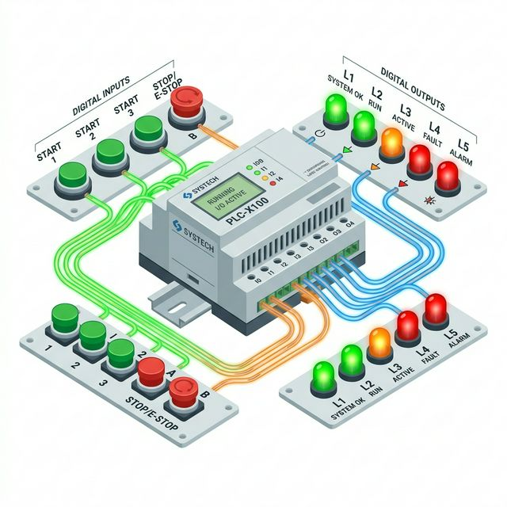
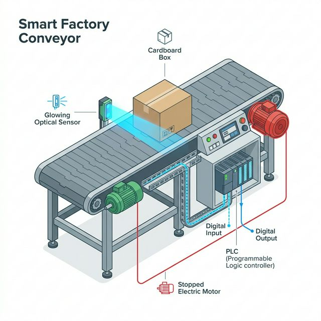

안녕하세요, 산업 제어 및 자동화 엔지니어 **MR.FIX**입니다!

PLC(Programmable Logic Controller)라는 거대한 두뇌를 다루기 위해 현장에서 가장 먼저 친숙해져야 할 개념이 있습니다. 바로 **DIO(디지털 입출력)**입니다. 복잡한 전자 회로 이론이나 두꺼운 메뉴얼보다는, 실제 공장 현장에서 장비가 어떻게 움직이고 멈추는지 **직관적인 감각과 실무 관점**으로 1편을 시작해 보겠습니다.

## 목차
- [PLC의 감각 기관: Digital Input (입력)](#plc의-감각-기관-digital-input-입력)
- [PLC의 근육: Digital Output (출력)](#plc의-근육-digital-output-출력)
- [한 눈에 보는 DIO 제어 흐름도](#한-눈에-보는-dio-제어-흐름도)
- [MR.FIX의 현장 실무 팁: 입력과 출력 헷갈리지 않기](#mrfix의-현장-실무-팁-입력과-출력-헷갈리지-않기)
- [마치며: 다음 리포트 예고](#마치며-다음-리포트-예고)

---

## PLC의 감각 기관: Digital Input (입력)

우리가 눈으로 보고 귀로 듣고 피부로 느끼듯, 제어기인 **PLC 역시 현재 외부 설비가 어떤 상태인지 정확히 파악해야 판단을 내릴 수 있습니다.** 이때 정보를 투입하는 통로가 바로 **Digital Input(DI)**입니다.

*   **본질적 역할:** 작업자나 기계 스위치로부터 발생하는 외부의 물리적 상태 변화를 전기적 신호(0 또는 1)로 변환하여 PLC 내부 메모리로 들여오는 것.
*   **대표적인 센서(입력 기기):**
    *   **푸시 버튼(Push Button):** 작업자가 직접 기계를 조작할 때 누르는 버튼
    *   **리미트 스위치(Limit Switch):** 실린더나 이동 물체가 끝단에 도달했는지 물리적으로 부딪혀 감지하는 스위치
    *   **광학 센서 및 근접 센서:** 물체의 유무나 위치를 빛, 자기장 등으로 비접촉 감지
*   **작동 핵심 메커니즘:** 스위치를 누르거나 센서가 물체를 감지했을 때, 닫힌 접점을 통해 24V(직류) 전기가 PLC 입력 카드 단자로 쏙 들어오게 됩니다. PLC의 CPU는 특정 어드레스(예: X000, %I0.0)로 전압이 인가된 것을 확인하고, 내부적으로 **"아! 누군가 1번 스위치를 눌렀구나!"** 하고 상태를 `1(On)`로 인식하게 됩니다.

---

## PLC의 근육: Digital Output (출력)

PLC가 외부 상황(Input)을 인지하고 내부 래더 프로그램(Ladder Logic)을 거쳐 최종 결정을 내렸다면, 이제는 물리적인 세계에 영향력을 행사하여 행동을 취해야 합니다. 전등을 켜거나, 밸브를 열고, 모터 전원을 차단하는 등 외부 장치에 명령을 내보내는 통로가 **Digital Output(DO)**입니다.

*   **본질적 역할:** PLC의 연산 로직(CPU)이 판단한 논리적 결과(`0` 또는 `1`)를, 실제 전압과 전류를 갖춘 전기 에너지 형태로 변환하여 외부 액추에이터(구동기기)로 보내는 것.
*   **대표적인 액추에이터(출력 기기):**
    *   **램프(Indicator Lamp):** 설비의 구동/정지/알람 상태를 시각적으로 표시
    *   **솔레노이드 밸브(Solenoid Valve):** 공압 실린더 전진/후진을 제어하는 밸브
    *   **전자 접촉기(Magnetic Contactor/Relay):** 거대한 모터나 히터에 메인 전원을 공급하기 위해 동작하는 스위치
    *   **경광등 및 부저:** 이상 발생 시 위험을 알림
*   **작동 핵심 메커니즘:** PLC 내부 소프트웨어에서 특정 코일(예: Y000, %Q0.0)을 `On` 시키는 연산 조건이 성립되면, DO 출력 카드의 내부 스위치(릴레이나 TR)가 닫힙니다. 그 순간 24V 전기 에너지가 출력 단자를 타고 흘러나와, 연결된 램프를 밝히거나 릴레이 코일을 여자(Excitation)시킵니다.

---

## 한 눈에 보는 DIO 제어 흐름도

현장에서 발생하는 아주 기본적인 시퀀스 제어 사이클은 무한한 **"감지(Input) -> 연산(Logic) -> 구동(Output)"**의 흐름으로 이루어집니다. 가장 흔한 물류 컨베이어 벨트를 예로 들어보겠습니다.

> **[상황 모델]** 컨베이어 벨트 끝단에 박스가 도착하면 컨베이어 모터를 즉시 정지시킨다.
> 
> 1.  **입력 감지 (Sensor DI):** 컨베이어 끝단의 포토 센서가 다가온 박스를 감지합니다. 즉시 PLC 입력 단자 `X001`로 전기를 흘려보내 `1(On)` 신호를 전달합니다.
> 2.  **논리 연산 (PLC CPU):** 밀리초(ms) 단위로 스캔 중이던 PLC CPU가 해당 래더 다이어그램을 연산합니다. *"X001이 On 되었으니, 컨베이어 가동 출력 Y000을 초기화(Reset) 해야지."*
> 3.  **명령 출력 (Relay DO):** PLC 출력 단자 `Y000`에서 흘러나가고 있던 전압을 즉시 차단합니다. `0(Off)` 상태가 되며, 전자 접촉기가 떨어지고 궁극적으로 메인 모터의 3상 전원이 차단되어 컨베이어가 정지합니다.

---

## MR.FIX의 현장 실무 팁: 입력과 출력 헷갈리지 않기

제어 설계를 처음 접하거나, 갓 배선 실버를 든 초보자분들이 도면을 볼 때 가장 흔하게 하는 실수가 바로 **"센서가 결과를 내놓으니까 출력이 아닌가요?"** 라며 입력(Input)과 출력(Output) 단자를 반대로 이해하는 것입니다. 

DIO를 명확하게 나누는 기준은 오직 한 가지, **'PLC 메인 컨트롤러 입장에서 생각하는 것'**입니다.

*   **전기 스위칭 신호가 PLC '안으로' 들어오는가?** → **Input (입력)** 
    *   (예: PLC가 다른 센서의 이야기를 듣고 정보를 수집하는 과정)
*   **전기 에너지(명령)가 PLC '밖으로' 나가는가?** → **Output (출력)**
    *   (예: PLC가 외부 기기에게 똑바로 일하라고 명령을 지시하는 과정)

이 대원칙만 머릿속에 깊게 새긴다면 결선 도면을 볼 때 Input 카드와 Output 카드를 절대 헷갈리는 일이 없을 것입니다.

---

## 마치며: 다음 리포트 예고

DIO는 단순해 보이지만, PLC 제어 시스템 트러블슈팅의 약 50% 이상을 차지할 만큼 매우 본질적이고 중요한 핵심 기초입니다. '들어오고 나가는 전기'의 논리적 흐름만 정확히 이해해도 이미 절반은 훌륭한 엔지니어에 다가선 것입니다.

하지만 실제 배터리 박스를 열고 결선을 하려고 보면 당황스러운 순간이 찾아옵니다. 현장 도면에는 센서 선이 3가닥이 튀어나와 있고, PLC 단자대에는 **"COM이 뭐지? NPN? PNP는 또 뭔데?"** 하는 의문이 생기기 마련입니다. 이 지점이 많은 초보 제어 엔지니어들이 가장 처음으로 크게 좌절하는 마의 구간입니다.

**다음 [PLC 입문] 2편에서는, 실무 배선의 핵심이자 '지옥의 NPN/PNP와 싱크/소스(Sink/Source)' 전류의 흐름 개념을 MR.FIX만의 직관적인 스타일로 아주 시원하게 뚫어 드리겠습니다!**
