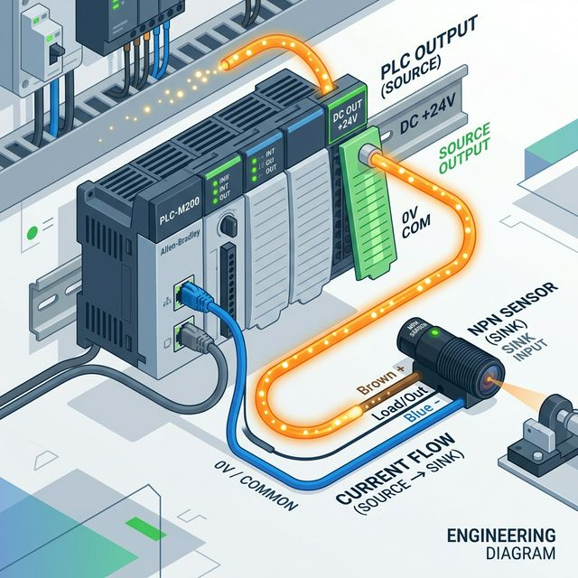
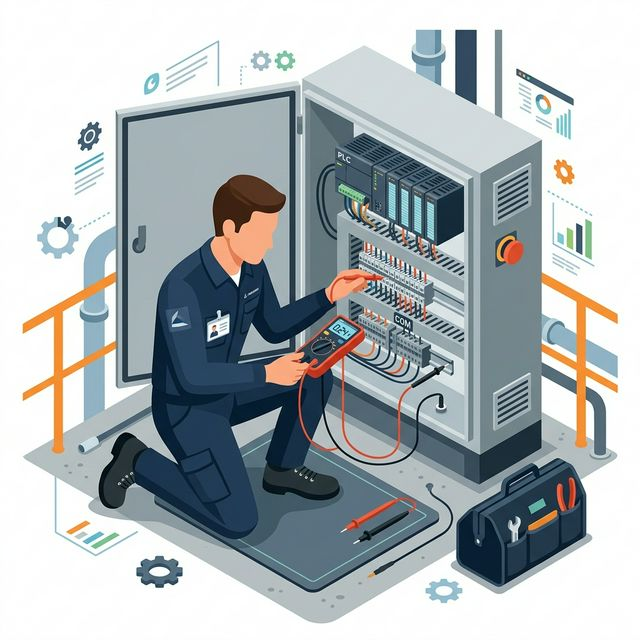

안녕하세요, 현장의 미친 해결사 **MR.FIX**입니다!

지난 1편에서 디지털 입출력(DIO)의 '들어오고 나가는 전기'의 큰 그림을 잡았습니다. 이번 2편에서는 갓 배선 드라이버를 잡은 초보 제어 엔지니어들이 도면 앞에서 가장 크게 좌절하는 죽음의 구간인 **NPN/PNP 방식과 싱크/소스(Sink/Source)의 짝짓기**를 정복할 차례입니다.

헷갈리기 쉬운 복잡한 반도체 접합 이론은 과감히 생략하고, 오늘은 당장 공구통을 들고 나가서 배선할 수 있도록 '직관적인 전기의 물길'로 이해해 보겠습니다.

## 목차
- [1. 전기가 어디로 흐르는가? (싱크 vs 소스)](#1-전기가-어디로-흐르는가-싱크-vs-소스)
- [2. NPN 센서 vs PNP 센서, 차이가 뭐야?](#2-npn-센서-vs-pnp-센서-차이가-뭐야)
- [3. 싱크와 소스의 완벽한 짝짓기 결선법](#3-싱크와-소스의-완벽한-짝짓기-결선법)
- [4. 절대 안 헷갈리는 'COM(공통 단자)' 묶는 공식](#4-절대-안-헷갈리는-com공통-단자-묶는-공식)
- [5. MR.FIX의 핵심 실무 한마디](#5-mrfix의-핵심-실무-한마디)

---

## 1. 전기가 어디로 흐르는가? (싱크 vs 소스)

PLC 배선의 가장 밑바탕이 되는 철학은 바로 **'전류는 +에서 -로 물처럼 흘러간다'**는 불변의 법칙입니다. 이 전기의 흐름(방향)을 기준으로 기기를 두 가지 방패로 분류하는데, 그것이 바로 싱크와 소스입니다. 딱 두 가지만 직관적으로 머릿속에 그리십시오.

*   **싱크(Sink) 타입:** 전기를 외부로부터 **'빨아들이는'** 쪽입니다. 마치 물이 흘러들어가는 싱크대 **하수구(배수구)**를 상상하세요. 전류가 무조건 자신의 단자 안으로 흘러 들어와야 작동합니다.
*   **소스(Source) 타입:** 자신의 내부에 있는 전기를 **'내보내는'** 쪽입니다. 시원하게 물을 뿜어내는 **수도꼭지**를 상상하세요. 전류가 반드시 밖으로 흘러 나가야 정상 작동합니다.

결선이란 결국 물을 뿜어내는 수도꼭지(소스)에서 물이 빠져나갈 배수구(싱크)를 호스로 연결해 주는 행위에 불과합니다.

---

## 2. NPN 센서 vs PNP 센서, 차이가 뭐야?

센서 카탈로그를 펼쳤을 때 가장 먼저 부딪히는 두 단어입니다. 둘 다 물체를 감지하면 신호를 보내는 센서임에는 동일하지만, **출력 신호의 성질**이 완전히 정반대입니다.

1.  **NPN 센서 (싱크 출력):**
    *   센서가 물체를 감지하면 센서 출력 단자가 0V(Minus, -) 쪽으로 쑥! 연결(스위칭)됩니다.
    *   따라서 센서 쪽으로 전기가 빨려 들어가야만 회로가 성립합니다.
    *   한국과 일본 장비, 그리고 아시아권에서 범용적으로 가장 흔하게 볼 수 있는 스탠다드 방식입니다.
2.  **PNP 센서 (소스 출력):**
    *   센서가 물체를 감지하면 센서 단자에서 24V(Plus, +) 전압이 펑! 하고 튀어나옵니다.
    *   때문에 밖으로 전기를 밀어내는 '수도꼭지' 역할을 합니다.
    *   유럽(CE 규격)이나 북미 기반의 글로벌 장비에서 강력하게 표준으로 채택하는 방식입니다.

---

## 3. 싱크와 소스의 완벽한 짝짓기 결선법

가장 중요한 건 '호환성'입니다. 소스와 소스를 연결하거나 싱크와 싱크를 연결하면 전기가 꽉 막혀 흐르지 않습니다. 반드시 **[수도꼭지 → 배수구]** 형태로 짝을 지어 주어야 합니다.

*   PLC 입력 모듈이 **싱크(Sink) 타입** (배수구)이라면?
    *   외부에서 전기를 밀어 넣어 줄 수도꼭지가 필요합니다.
    *   따라서 **PNP 센서(소스 출력)**를 연결해야 완벽하게 전기가 흐릅니다.
*   PLC 입력 모듈이 **소스(Source) 타입** (수도꼭지)이라면?
    *   외부에서 전기를 받아줄 배수구가 필요합니다.
    *   따라서 **NPN 센서(싱크 출력)**를 연결해야만 합니다.

*※ 참고: 한국형 장비(LS산전, 멜섹 등 기본 세팅)는 보통 NPN 센서를 많이 쓰므로, PLC 입력 모듈 측은 소스(Source) 모드로 구성하는 것이 일반적입니다.*

---

## 4. 절대 안 헷갈리는 'COM(공통 단자)' 묶는 공식

이론상을 다 이해했어도, 막상 제어반 앞에서 다발로 묶인 전선 뭉치를 보면 머리가 하얗게 됩니다. 이럴 땐 오직 PLC 입력 모듈의 **COM(Common, 공통단자)**만 찾으십시오. 다른 건 다 몰라도 이 두 줄의 공식만 외우면 됩니다.

1.  **COM 단자에 (+24V)를 물려 묶었다구요?**
    *   PLC가 전기를 밀어내는 강력한 소스(수도꼭지) 모드가 되었습니다.
    *   → 상대방 센서는 당연히 전압을 빼줄 **NPN(싱크) 센서**를 달아야 정상 작동합니다.
2.  **COM 단자에 (0V / Minus)를 물려 묶었다구요?**
    *   PLC가 전기를 쏙쏙 빨아들이는 싱크(하수구) 모드로 변신했습니다.
    *   → 상대방 센서는 외부에서 24V를 팍팍 쏴주는 **PNP(소스) 센서**를 달아야 합니다.

이 규칙 하나면 센서를 잘못 사서 전부 교환하거나, 센서 보호 회로를 태워먹는 대참사를 막을 수 있습니다.

---

## 5. MR.FIX의 핵심 실무 한마디

"공무팀에서 급하게 센서가 고장 났다고 아무 센서나 재고실에서 가져오지 마십시오. NPN 센서를 사 왔는데, 이미 제어반 안에 있는 PLC의 COM 단자가 (-) Minus 0V 에 묶여있다면(싱크 모드) 절대 동작하지도 않을 뿐더러 최악의 경우 쇼트가 납니다. 센서 구매 전이나 도면 핀맵을 짤 때 **반드시 PLC 메인 모듈의 공통 단자(COM)가 어디에 묶여 설계되었는지부터 눈으로 매핑하는 습관을 들이세요!**"

---

2편의 지옥 구간을 무사히 건너신 것을 환영합니다! 생각보다 별거 아니죠?
**다음 [PLC 입문] 3편에서는 PLC가 명령을 '행동'으로 옮길 때 사용하는 출력의 손들, 즉 릴레이, TR, SSR 출력 카드의 스펙과 차이점에 대해 시원하게 알아보겠습니다.**
