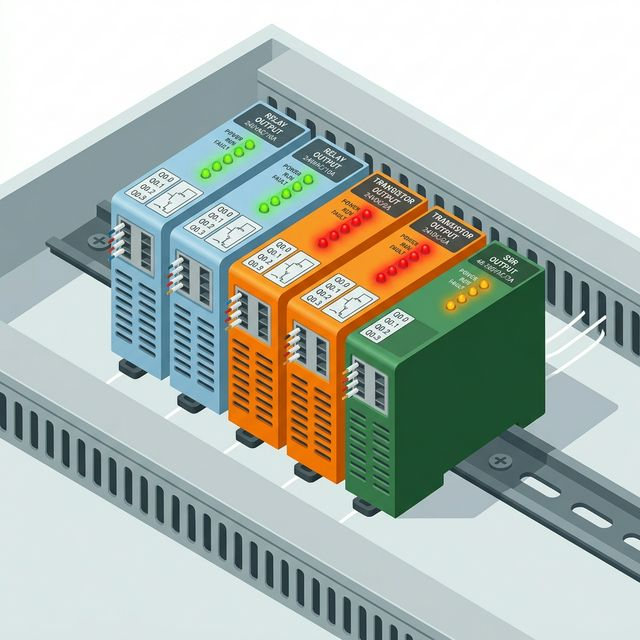
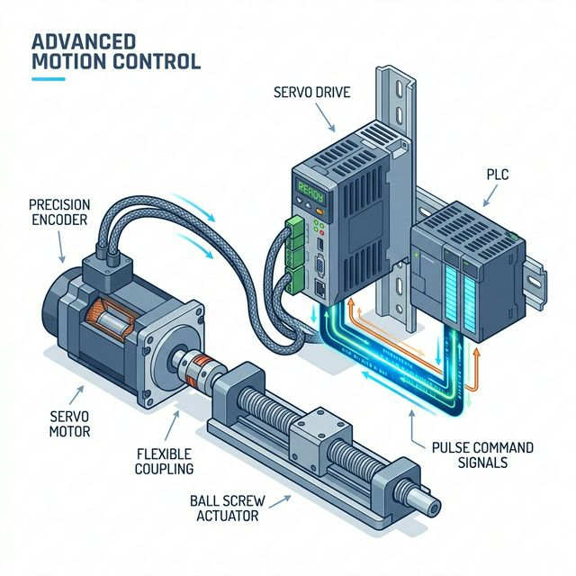

안녕하세요, 자동화 설비 제어 설계의 해결사 **MR.FIX**입니다!

입력(Input) 모듈을 통해 외부 세상의 버튼이 눌렸는지, 센서 앞에 물체가 있는지 파악했다면, 이제 PLC가 직접 일을 시킬 차례입니다. 프로그램 연산 결과를 바탕으로 램프를 켜고, 밸브를 열고, 모터를 쌩쌩 돌리게 만드는 통로가 바로 **출력(Output)**이라고 1편에서 말씀드렸습니다.

그런데 카탈로그를 열고 모델을 구매하려고 보면 출력 모듈의 종류가 한 가지가 아니라는 사실에 당황하게 됩니다. 
가장 대표적인 출력 소자 3대장인 **릴레이(Relay), 트랜지스터(TR), SSR(Solid State Relay)** 모듈의 차이점과 완벽한 선정 기준을 현장 눈높이에서 정리해 드리겠습니다.

## 목차
- [1. 릴레이(Relay) 출력: 만능 해결사, 그러나 수명이 유한한 거인](#1-릴레이relay-출력-만능-해결사-그러나-수명이-유한한-거인)
- [2. TR(Transistor) 출력: 무소음, 고속 제어의 왕](#2-trtransistor-출력-무소음-고속-제어의-왕)
- [3. SSR(Solid State Relay) 출력: 소음 없는 정밀 제어의 강자](#3-ssrsolid-state-relay-출력-소음-없는-정밀-제어의-강자)
- [4. 한눈에 보는 PLC 출력 소자 비교표](#4-한눈에-보는-plc-출력-소자-비교표)
- [5. MR.FIX의 핵심 실무 한마디](#5-mrfix의-핵심-실무-한마디)

---

## 1. 릴레이(Relay) 출력: 만능 해결사, 그러나 수명이 유한한 거인

가장 고전적이면서도 현장에서 무난하게 가장 많이 쓰이는 방식입니다. 쉽게 말해 PLC 껍데기 안에 손가락 체구만 한 진짜 물리적 기계 스위치가 조밀조밀하게 박혀 있다고 상상하시면 됩니다.

*   **동작 원리:** 전자석 코일에 전기가 통하면 자력이 발생해 쇳조각(접점)을 당겨 붙게 만드는 고전적인 전자기 원리를 작동시킵니다.
*   **장점 (만능 해결사):** 
    *   극성과 전압에 관대합니다. **AC(교류) 220V 든, DC(직류) 24V 든 아무거나 걸어 써도** 접점만 붙여주는 역할이므로 전부 호환됩니다.
    *   하나의 접점이 버틸 수 있는 '허용 전류'가 2A~3A 정도로 출력 모듈 중에 가장 높습니다.
    *   구동하려는 작은 밸브나 표시 램프 등은 별도의 중간 릴레이 없이 PLC 출력 카드로 **직접 구동(Direct Drive)**이 가능할 정도로 힘이 셉니다.
*   **단점 (기계적 한계):**
    *   물리적으로 철컥철컥 부딪혔다 떨어지기 때문에 '소음'이 발생합니다.
    *   기계식의 본질적 한계, 즉 **'수명(보통 100만 회 내외)'**이 존재합니다. 
    *   쇠가 붙었다 떨어지는 물리적 시간이 필요하므로 응답 속도가 대략 10ms 수준으로 매우 느립니다. 초당 수십~수백 번을 깜빡이는 펄스 제어는 꿈도 꿀 수 없습니다.

---

## 2. TR(Transistor) 출력: 무소음, 고속 제어의 왕

TR 출력은 기계적인 움직임을 모조리 빼버리고 오직 '반도체 소자'만으로 전기의 길을 열었다 끊었다 하는, 아주 빠르고 조용한 디지털 스위치입니다. 

*   **동작 원리:** 트랜지스터(반도체)의 베이스 단자에 아주 미세한 신호를 주면 콜렉터와 이미터 사이의 거대한 전기 흐름이 툭 통하는 전자적인 원리입니다.
*   **장점 (고속/영구적 수명):**
    *   물리적으로 움직이는 부품이 없기 때문에, 쇼트를 내지 않는 이상 **수명이 반영구적**입니다. 
    *   스위치를 켜고 끄는 속도가 빛처럼 빠릅니다(마이크로초 단위). 서보 모터를 정밀하게 구동하기 위한 고속 펄스(PWM 등) 출력 용도로는 선택이 아닌 필수입니다.
*   **단점 (조건의 까다로움):**
    *   **오직 DC(직류) 전원**에만 거꾸로 꽂지 못하게 극성을 맞춰서 연결해야 작동합니다. (AC 교류엔 절대 못 씁니다.)
    *   소자가 매우 극소형이라 허용 전류가 0.1A ~ 0.5A 수준으로 형편없이 작습니다.
    *   즉, 램프 한두 개까지는 켤 수 있어도, 모터 릴레이 같은 거친 부하에 꽂았다가는 반도체가 뻥 터져 교체(수리비)의 아픔을 맛보게 됩니다. 무조건 중간에 외부 릴레이 보드를 한 번 거쳐서 힘을 키워줘야 합니다.

---

## 3. SSR(Solid State Relay) 출력: 소음 없는 정밀 제어의 강자

SSR은 '무접점 릴레이'라고도 불리며, 릴레이의 강력한 전원 호환성과 TR의 기계적 움직임 없음(무접점, 무소음)이라는 장점만 예쁘게 섞어 놓은 혼종(?) 반도체 출력 소자입니다.

*   **특징:**
    *   빛으로 신호를 넘겨주는 '포토커플러'나 사이리스터 소자를 넣어 만들었습니다. 당연히 접점이 부딪히는 소리 없이 조용합니다.
    *   반도체이므로 기계적 마모가 없어 수명이 길며, 릴레이보다는 빠르고 TR보다는 느린 중간 정도의 속도를 냅니다.
    *   가장 큰 차이점은 **AC 전용 SSR**이 따로 존재한다는 것입니다.
*   **주요 용도:**
    *   히터 온도 제어처럼 1초에도 여러 번씩 AC 220V 전원을 켰다 껐다(PID 비례 제어) 해야 하는 곳에 특효약입니다. 만약 이런 곳에 일반 릴레이를 달았다면, 다다다닥 하는 기관총 소음과 함께 반나절 만에 접점이 녹아 붙어버립니다.

---

## 4. 한눈에 보는 PLC 출력 소자 비교표

현장 가방에 하나 출력해 두고 헷갈릴 때마다 조견표로 쓰시면 유용합니다.

| 구분 | 릴레이(Relay) | 트랜지스터(TR) | 무접점 릴레이(SSR) |
| :--- | :--- | :--- | :--- |
| **회로 소자** | 전자석 + 기계식 접점 | 트랜지스터 (반도체) | 포토 사이리스터/트라이액 |
| **사용 전원** | **AC / DC 아무거나 다** | **DC 12~24V 전용** | 주로 AC 제어에 널리 씀 |
| **기계적 수명** | 유한 (딸깍거리다 고장남) | 사실상 영구적 | 반영구적 |
| **반응 속도** | 느림 (약 10ms) | **굉장히 빠름 (1ms 이하)** | 빠름 (약 1ms) |
| **허용 전류** | 높음 (2~3A) - 직결 용이 | **매우 낮음 (0.5A)** | 중간~높음 |
| **소음 (딸깍)** | 치명적으로 큼 | 완전 무소음 | 조용함 |

---

## 5. MR.FIX의 핵심 실무 한마디

"PLC 랙의 남는 자리 출력 카드를 고르려고 카탈로그를 펼쳤습니까?
단순히 공장 내 큰 램프 점등, 외부 컨택터 기동 정도라면 **고민 없이 릴레이 출력 모듈**을 고르십시오.
그러나 현장에 서보 모터를 위치 제어(위치 결정 모듈)해야 하거나, 1초에 수백 번 통신을 깜빡여야 한다면 그 즉시 **TR 출력 모듈 단일 선택지**로 좁혀야 합니다. 용도를 모르고 잘못 주문했다가는 하드웨어 카드 자체가 스펙 미달로 뻥뻥 터져나가며 밤샘 작업을 하게 됩니다!"

---

**이것으로 초보 제어 엔지니어분들을 위한 [PLC 입문] DIO 기초 3부작 시리즈를 모두 마칩니다. 
어디를 가든 쫄지 마십쇼! 전기는 정직합니다. 언제나 안전 작업하시고 의문점이 생기면 꼭 댓글 남겨주시기 바랍니다!**
