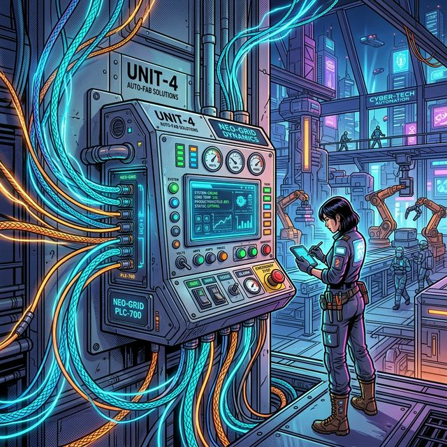
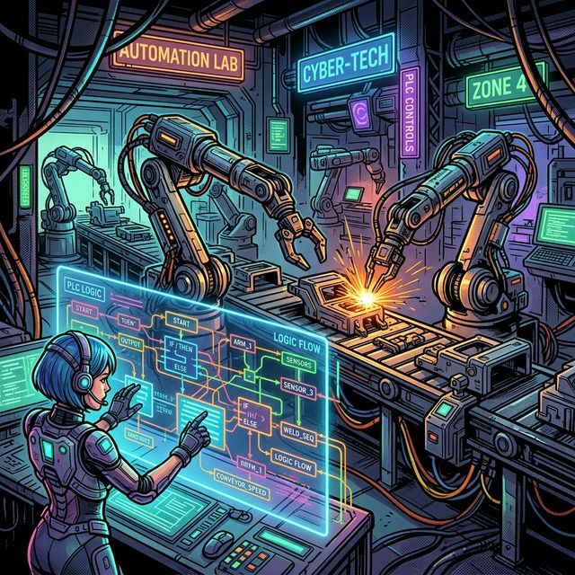

산업 현장의 복잡한 제어 시스템을 효율적으로 구축하고 장기적인 안정성을 확보하는 것은 모든 엔지니어의 핵심 과제입니다. 본 분석은 프로그래머블 로직 컨트롤러(PLC)가 이러한 도전 과제를 어떻게 해결하며, 왜 현대 자동화의 필수 요소로 자리매김했는지 심층적으로 탐구합니다.

## 목차
- [서론: PLC의 본질적 역할](#서론-plc의-본질적-역할)
- [PLC의 핵심 기능 및 운영 효율성](#plc의-핵심-기능-및-운영-효율성)
  - [간결한 배선 및 회로 복잡성 감소](#간결한-배선-및-회로-복잡성-감소)
  - [유연한 제어 로직 변경](#유연한-제어-로직-변경)
  - [프로젝트 자산의 영속성](#프로젝트-자산의-영속성)
- [산업 환경에 최적화된 설계](#산업-환경에-최적화된-설계)
  - [탁월한 내구성과 장기 지원](#탁월한-내구성과-장기-지원)
  - [모듈형 확장성](#모듈형-확장성)
- [결론: PLC, 산업 자동화의 미래](#결론-plc-산업-자동화의-미래)

## 서론: PLC의 본질적 역할
프로그래머블 로직 컨트롤러(PLC)는 산업 환경에서 공정을 제어하고 자동화하기 위해 설계된 전용 컴퓨터입니다. 이는 인간의 개입을 최소화하고 시스템의 정밀도 및 효율성을 극대화하는 핵심적인 역할을 수행합니다. PLC는 단순 반복 작업을 넘어 복잡한 시퀀스 제어에 이르기까지 광범위한 자동화 요구사항에 대응하며, 현대 산업 설비의 안정적인 운영을 위한 필수 불가결한 요소로 기능합니다.

## PLC의 핵심 기능 및 운영 효율성

### 간결한 배선 및 회로 복잡성 감소
PLC 시스템은 실제 현장의 입력(Input) 및 출력(Output) 장치들을 컨트롤러에 직접 배선할 수 있도록 설계되었습니다. 이 방식은 불필요한 제어 장치들의 사용을 배제하여 다음과 같은 **명확한 이점**을 제공합니다.
*   **비용 절감**: 추가적인 하드웨어 구매 및 설치 비용이 감소합니다.
*   **회로 복잡성 완화**: 제어 회로의 설계 및 구현이 현저히 단순해집니다.
이는 초기 설치 단계뿐만 아니라 유지보수 및 문제 해결 과정에서도 상당한 효율성 증대를 가져옵니다.

### 유연한 제어 로직 변경
기존의 하드와이어드(Hard-wired) 제어 회로와 달리, PLC는 제어 로직 변경이 매우 용이합니다. 제어 알고리즘의 수정이 필요할 경우, **제어반의 물리적 재배선 없이** PLC 프로젝트 파일 내에서 소프트웨어적으로 변경이 가능합니다. 예를 들어, 다수의 모터 가동 시 순차적 시작 시간 조정 또는 특정 운전 시간 설정과 같은 복잡한 요구사항도 래더 로직(Ladder Logic) 코드 내에서 간단히 타이머 및 접점을 추가하여 구현할 수 있습니다. 이러한 유연성은 시스템의 **가동 중단 시간을 최소화**하며 신속한 공정 최적화를 가능하게 합니다.

### 프로젝트 자산의 영속성
최신 PLC는 전체 프로젝트를 내부 메모리에 저장하며, 일반적으로 국제 표준 프로그래밍 언어를 사용합니다. 이는 다음과 같은 **전략적 이점**을 제공합니다.
*   **지식 자산 보호**: 시스템 설계 및 구현에 투입된 기술적 지식과 노력이 손실될 염려가 없습니다.
*   **유지보수 용이성**: PLC에 익숙한 엔지니어라면 누구나 프로젝트를 이해하고 디버깅할 수 있어, 기술 인력의 변동에도 불구하고 시스템의 지속적인 관리가 가능합니다.
이러한 특성은 장기적인 관점에서 **유지보수 비용을 절감**하고 시스템의 안정적인 운영을 보장합니다.

## 산업 환경에 최적화된 설계

### 탁월한 내구성과 장기 지원
PLC는 일반적인 컴퓨터와 달리 **산업 현장의 가혹한 조건**을 견디도록 특별히 설계되었습니다. 이는 진동, 먼지, 온도 변화, 전기적 노이즈 등 다양한 외부 요인에 대한 높은 저항성을 의미합니다. 결과적으로 PLC는 **뛰어난 수명**을 가지며, 제조사들은 일반적으로 20년에서 30년 이상 부품 공급 및 프로그래밍 소프트웨어 지원을 보장합니다. 이는 시스템 구축 후 수십 년이 지난 후에도 예비 부품 확보 및 유지보수 소프트웨어 호환성에 대한 **걱정을 덜어줍니다.**

### 모듈형 확장성
PLC 시스템은 필요에 따라 **쉽게 확장**할 수 있는 모듈형 구조를 채택하고 있습니다. 추가적인 입출력(I/O) 용량이 요구될 경우, 기존 시스템 전체를 교체할 필요 없이 필요한 모듈을 추가 장착함으로써 기능을 확장할 수 있습니다. 이러한 유연성은 초기 투자 비용을 효율적으로 관리하고, 미래의 시스템 변경 및 증설에 대한 **대응력을 강화**합니다.

## 결론: PLC, 산업 자동화의 미래
프로그래머블 로직 컨트롤러(PLC)는 단순한 제어 장치를 넘어, 현대 산업 자동화의 **핵심적인 인프라**입니다. 간결한 배선, 유연한 로직 변경, 프로젝트 자산의 영속성, 산업 환경에 최적화된 내구성 및 장기 지원, 그리고 뛰어난 확장성은 PLC가 제공하는 **핵심적인 기술적 가치**입니다. 이러한 특성들은 생산 공정의 효율성을 극대화하고, 유지보수 비용을 절감하며, 시스템의 장기적인 안정성을 보장합니다. 따라서 PLC는 변화하는 산업 환경 속에서 **지속 가능한 경쟁 우위**를 확보하기 위한 필수적인 전략적 선택이며, 앞으로도 산업 자동화의 발전을 이끌어갈 중요한 축으로 기능할 것입니다.