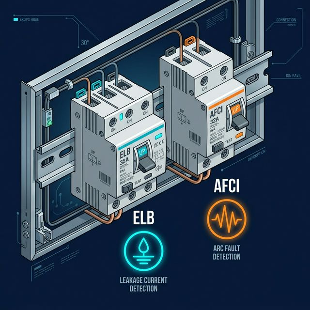
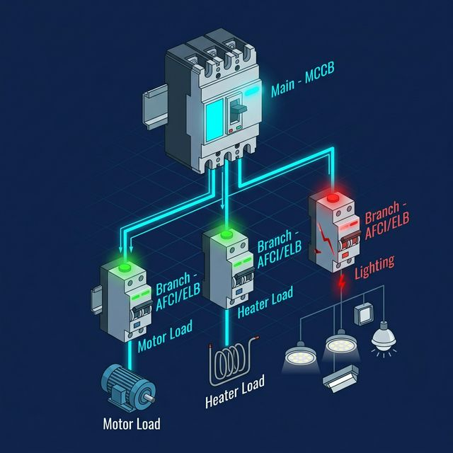

안녕하세요, 산업 제어 및 자동화 엔지니어 **MR.FIX**입니다!

전기 설계를 업으로 삼은 지 9년, 수많은 제어반을 설계하면서도 항상 고민되는 지점은 **'안전과 가동률 사이의 밸런스'**입니다. 오늘은 최근 국내외에서 관심이 높아지고 있는 **아크차단기(AFCI)**와 우리가 흔히 쓰는 **누전차단기(ELB)**의 차이, 그리고 효율적인 계통 구성에 대해 정리해 보겠습니다.

## 목차

- [누전차단기와 아크차단기, 무엇이 다른가?](#누전차단기와-아크차단기-무엇이-다른가)
- [메인에 아크차단기를 설치하면 안 되는 실무적 이유](#메인에-아크차단기를-설치하면-안-되는-실무적-이유)
- [가장 이상적인 계통 구성: 분기 보호의 원칙](#가장-이상적인-계통-구성-분기-보호의-원칙)
- [MR.FIX의 현장 실무 팁](#mrfix의-현장-실무-팁)

---

## 누전차단기와 아크차단기, 무엇이 다른가?

우리나라는 전통적으로 누전차단기(ELB) 중심의 안전 체계를 가지고 있습니다. 두 차단기는 감지하는 '사고의 종류' 자체가 다릅니다.



| 구분 | ELB (누전차단기) | AFCI (아크차단기) |
|---|---|---|
| 감지 대상 | **지락 전류** (전류가 땅으로 새는 현상) | **아크 전류** (절연 파괴에 의한 스파크) |
| 주요 보호 목적 | **감전 사고** 예방 | **전기 화재** 예방 |
| 주요 적용 환경 | 습기가 많은 환경, 욕실·주방 | 건식 벽체, 목조 건물, 전선 노후 환경 |
| 국내 의무 여부 | 광범위하게 의무화 | 사실상 미적용 (대부분 미국 수출) |

*   **ELB (Earth Leakage Breaker):** 전류가 정상 경로를 벗어나 땅으로 새는 것(지락)을 감지합니다. 주로 습기가 많은 환경에서 발생하는 **감전 사고**를 막는 데 탁월합니다.

*   **AFCI (Arc Fault Circuit Interrupter):** 전선 사이의 느슨한 접촉이나 절연 파괴로 인해 발생하는 미세한 스파크(아크)를 감지합니다. 미국처럼 목조 주택이 많아 전기 불꽃에 의한 **화재 위험이 큰 곳**에서 2000년대 초반부터 의무화되었습니다.

> **흥미로운 현장 에피소드:** 국내 대기업인 LS일렉트릭에 아크차단기를 문의했을 때, *"국내 수요가 적어 생산 물량의 대부분을 미국으로 수출한다"*는 답변을 들었습니다. 한국은 콘크리트 구조물이 많아 **화재보다 감전에 더 집중**해 온 결과입니다.

---

## 메인에 아크차단기를 설치하면 안 되는 실무적 이유

이론적으로는 메인 차단기를 AFCI로 쓰면 설비 전체의 아크를 방지할 수 있을 것 같지만, **실무 설계에서 이는 최악의 선택**이 될 수 있습니다.

**첫째, '정상 아크'와 '사고 아크' 구분의 문제입니다.**

현장의 전자접촉기(MC)나 일반 가전제품은 동작할 때 미세한 아크를 발생시킵니다. 아크차단기는 이 파형을 분석하는데, 여러 분기 회로에서 올라오는 정상적인 노이즈가 메인 단에서 합쳐지면 차단기가 이를 사고로 오인해 전체 전원을 내려버리는 **'오작동(Nuisance Tripping)'**이 빈번해집니다.

**둘째, 유지보수의 지옥이 열립니다.**

메인이 떨어지면 어느 분기 회로의 어느 전선에서 스파크가 튀었는지 찾을 방법이 없습니다. **가동률이 생명인 산업 현장**에서 원인을 알 수 없는 메인 트립은 막대한 손실로 이어집니다.

---

## 가장 이상적인 계통 구성: 분기 보호의 원칙

전기 설계의 정석은 **"사고가 난 지점만 정확히 도려내는 것"**입니다. 따라서 저는 다음과 같은 구성을 추천합니다.



*   **메인 단: 배선용 차단기(MCCB)**를 배치하여 전체 부하의 단락 및 과부하를 보호합니다.
*   **분기 단:** 누전과 아크를 동시에 감지할 수 있는 **AFCI/ELB 겸용 차단기**를 설치합니다.

이렇게 하면 특정 모터나 전열 라인에서 아크가 발생했을 때 **해당 라인만 차단**되므로, 나머지 설비는 정상 가동을 유지하면서 사고 지점을 즉시 파악할 수 있습니다.

```
[메인 MCCB]
    ├── [분기 AFCI/ELB] → 모터 라인  ← 🔴 트립 (나머지는 정상 가동)
    ├── [분기 AFCI/ELB] → 전열 라인  ✅
    └── [분기 AFCI/ELB] → 조명 라인  ✅
```

---

## MR.FIX의 현장 실무 팁

> **기술은 날로 발전하지만, 그 기술을 배치하는 방식(Architecture)은 엔지니어의 경험에서 나옵니다.**

아직 국내에선 AFCI가 낯설 수 있지만, 안전의 기준이 점차 높아지는 만큼 설계 단계에서부터 이러한 특성을 반영하는 자세가 필요합니다. 특히 **노후화된 공장 전선 구간**이나 **건식 벽체 내 전선이 지나가는 구간**에 리모델링 공사를 한다면, AFCI 분기 차단기 도입을 지금부터 검토해 보시길 권장합니다.

이전 포스팅에서 다룬 서지킬러와 함께, 차단기 계통 설계는 설비의 **생존 전략**입니다. 작은 부품 하나, 차단기 하나의 위치 선정이 장기적인 가동률과 안전을 결정합니다.
