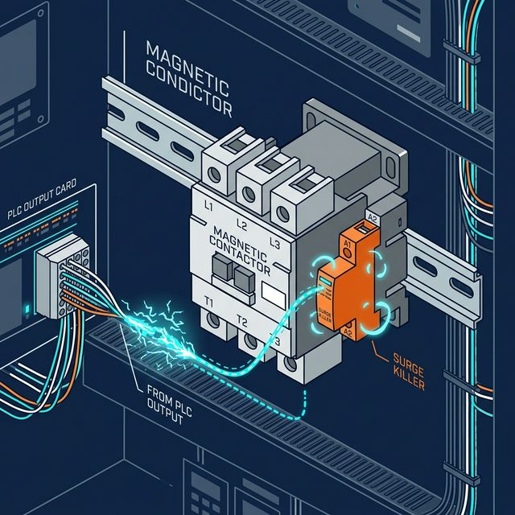
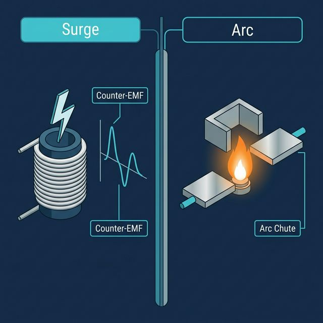

안녕하세요, 산업 제어 및 자동화 엔지니어 **MR.FIX**입니다!

최근 장비의 I/O 체크 자동화 툴을 개발하며 소프트웨어와 하드웨어의 긴밀한 상호작용을 다시금 복기하고 있습니다. 오늘은 현장에서 가장 기초적이면서도 자칫 간과하면 **PLC 출력 카드나 정밀 제어 기기에 치명적인 손상**을 입힐 수 있는 전자접촉기(MC)의 서지 및 스파크 방지 대책에 대해 깊이 있게 다뤄보겠습니다.

## 목차

- [서지킬러(Surge Killer), 어디를 보호하는가?](#서지킬러surge-killer-어디를-보호하는가)
- [주접점의 아크(Arc)와는 무엇이 다른가?](#주접점의-아크arc와는-무엇이-다른가)
- [실무에서의 선정 노하우: 카탈로그가 법전이다](#실무에서의-선정-노하우-카탈로그가-법전이다)
- [MR.FIX의 현장 실무 팁](#mrfix의-현장-실무-팁)

---

## 서지킬러(Surge Killer), 어디를 보호하는가?

먼저 개념 정리가 필요합니다. 전자접촉기(MC)를 사용하다 보면 *"서지킬러를 단자에 달아야 하나요?"* 라는 질문을 종종 받습니다. 하지만 정확한 위치는 **MC의 전원 코일 단자(A1, A2)** 입니다.

MC 코일은 전형적인 **유도성 부하(Inductive Load)**입니다. 코일에 흐르던 전원을 차단하는 순간, 내부에 축적된 자기 에너지는 렌츠의 법칙에 의해 급격히 소멸하며 반대 방향으로 아주 높은 전압인 **역기전력(Counter-EMF)**을 발생시킵니다. 이것이 바로 우리가 말하는 **개폐 서지(Switching Surge)**입니다.

서지킬러는 이 높은 전압을 흡수하거나 소멸시켜, MC를 제어하는 PLC의 접점이나 반도체 출력 소자가 파손되는 것을 방지하는 역할을 합니다.

---

## 주접점의 아크(Arc)와는 무엇이 다른가?

많은 분이 헷갈려하시는 부분이 **'서지'와 '아크'의 차이**입니다.

*   **서지(Surge):** 코일의 자기 에너지 소멸 시 발생하는 '전압적 충격'입니다. **제어 회로(PLC단)를 보호**하기 위해 서지킬러를 씁니다.

*   **아크(Arc):** 주접점(L1~T3)을 통해 모터 같은 대전류 부하를 끄고 켤 때, 접점 사이의 공기가 이온화되며 발생하는 '불꽃 현상'입니다.

> **핵심 구분:** 주접점의 아크는 서지킬러가 아니라 MC 자체의 **소호실(Arc Chute)** 구조나 별도의 대용량 **스누버(Spark Killer)**가 담당합니다. 즉, 우리가 흔히 말하는 서지킬러는 제어단을 위한 **'호신용' 장치**라고 보시면 됩니다.

---

## 실무에서의 선정 노하우: 카탈로그가 법전이다

현업에서 서지킬러의 용량을 어떻게 계산하느냐고 묻는다면, 저는 **"제조사 카탈로그를 믿으라"**고 답합니다.

저 역시 과거에 용량 선정을 위해 업체에 문의했던 경험이 있습니다. 그때 업체 담당자는 복잡한 수치 대신 *"사용하시는 MC 모델명이 무엇입니까?"* 라고 되물었습니다.

실제로 LS일렉트릭 등 주요 제조사의 MC 카탈로그를 펼쳐보면, 해당 MC의 프레임 용량과 코일 사양에 딱 맞춰진 **전용 서지유닛(Surge Unit) 모델명**이 표기되어 있습니다.

*   **물리적 일체성:** 전용 모델은 MC 본체 상단이나 측면에 딱 맞게 끼워지도록 설계되어 별도의 배선 작업이 필요 없습니다.
*   **전기적 최적화:** 코일의 소비전력과 인덕턴스 값에 맞춰 RC형, 바리스터형, 다이오드형 중 최적의 회로가 이미 셋팅되어 있습니다.

| 서지킬러 유형 | 동작 원리 | 적용 전압 |
|---|---|---|
| RC형 | 저항+커패시터로 에너지 분산 | AC 범용 |
| 바리스터(Varistor)형 | 전압 초과 시 저항 급감, 전류 흡수 | AC/DC 범용 |
| 다이오드형 | 역방향 전류만 차단 (정류) | DC 전용 |

---

## MR.FIX의 현장 실무 팁

> **부품 하나를 선정하더라도 감에 의존하기보다, 제조사가 제공하는 데이터시트와 카탈로그를 대조하는 습관이 설계의 완성도를 결정합니다.**

특히 제가 지금 개발 중인 PC 기반 제어 툴처럼 **노이즈에 민감한 환경**일수록, 규격에 맞는 서지킬러 장착은 선택이 아닌 **필수**입니다. 오작동이나 부품 교체 비용을 생각하면, 전용 서지유닛 하나의 단가는 아주 저렴한 '보험료'에 불과합니다.

다음 포스팅에서는 아크차단기(AFCI)와 누전차단기(ELB)의 차이, 그리고 효율적인 계통 구성에 대해 다뤄보겠습니다!
